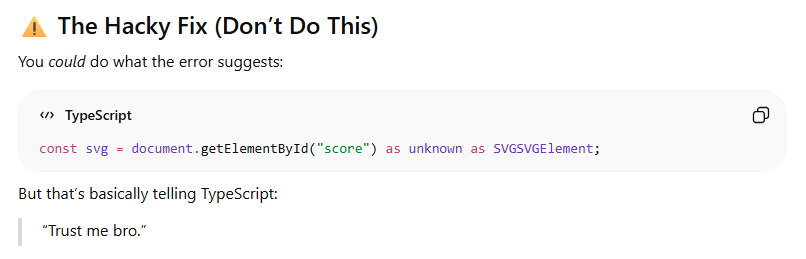

# Final Presentation: HalfStep

---

## Overview

---

### Metrics
- Total number of features: 8
- Number of features completed: 8
- Total number of requirements: 31*
- Number requirements completed: 31
- Total burndown rate: 100%
- Lines of Code: 2542

---

### What Went Wrong

- Time management
- Some features created out of order
- In retrospect, some of Sprint 2's requirements could have been done in Sprint 1
- So. Many. Errors.

---

### ChatGPT Debugging Highlight
</img>

---

### What Went Well

- Errors, while numerous, were easily fixed
- File structure was very rigid; few files needed to be moved, and files could be added with relative ease
- Most features that were added in Sprint 2 were already set up in Sprint 1
- Made me feel more confident in taking this up as a long-term project

---

# Progress Summary

---

### Sprint 1

Sprint 1-1: Score managmement

Sprint 1-2: Notation Data Model

Sprint 1-3: Note entry and Undo/Redo

Sprint 1-4: Measure/Time/Tempo logic

---

### Sprint 2

Sprint 2-1: ~~Finish Measure/Time/Tempo Logic and~~ begin Rendering Setup

Sprint 2-2: Finish Rendering Setup and begin Playback Logic

Sprint 2-3: Finalize Playback

Sprint 2-4: Import/Export

Sprint 2-5: Finish Import/Export; Final Touches

--- 

# Demonstration Overview

---

### Disclaimer

- I have completed all the work that I set out to do this semester
- However, there's still a long way to go
- I have already received feedback for extra features that I could (and plan to) add in the future
- The possibilities for scaling this app are practically endless
- However, it all begins with this...

---

### Live Demonstration

Linked here for the purposes of the presentation
http://localhost:3000/page

---

# Questions?

---

# Thank You